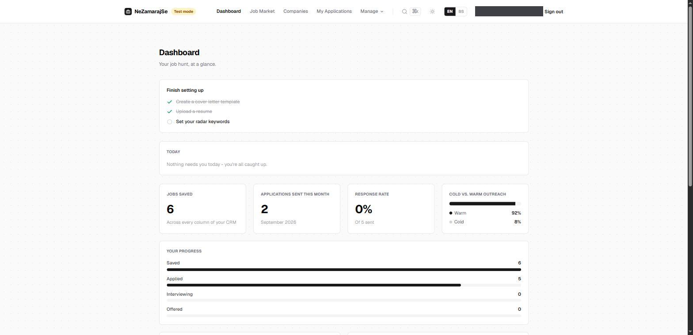
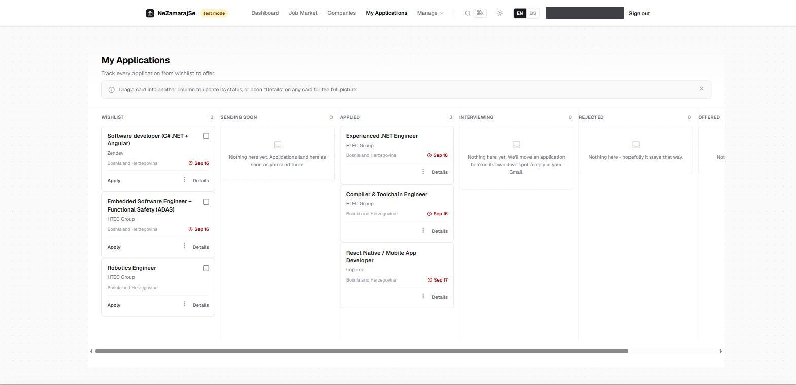
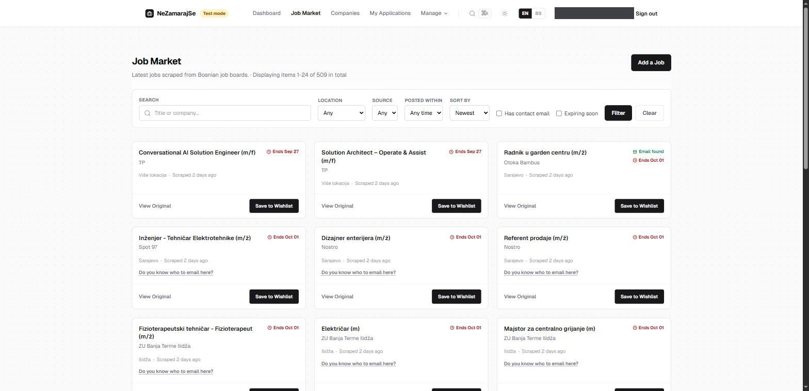
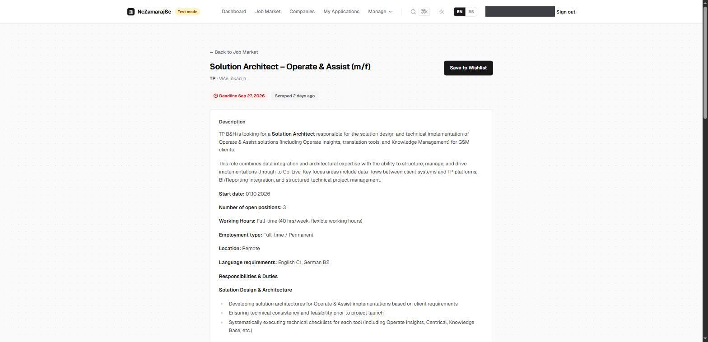

<div align="center">

# NeZamarajSe

**Automate your job hunt.**

A personal CRM, AI-powered cover letter engine, and job scraper built for the Bosnian IT market.

[](https://github.com/Oblutack/NeZamarajSe/actions/workflows/ci.yml)
[](.ruby-version)
[](Gemfile)
[](LICENSE)

</div>

---

## What it does

NeZamarajSe runs the entire job-hunting workflow end to end, without leaving
your inbox in the dark about it:

- **Scrapes** Bosnian job boards on a schedule with a headless-Chrome engine
  driven entirely by database-configured selectors — no redeploy needed to
  add a new source.
- **Enriches** every listing with AI, extracting a real, formatted
  description, the HR contact email, and the application deadline straight
  from the posting — with a headless-rendering fallback for job pages that
  only render client-side, and direct reads of embedded SSR state (Nuxt
  apps) when even that comes back empty.
- **Tracks** applications on a drag-and-drop Kanban board, from wishlist
  through offer, with a per-application timeline, follow-up reminders, and
  automatic reply detection against your own Gmail thread.
- **Sends** cover letters natively through your own Gmail account — real
  outbound mail, not a transactional relay — staggered automatically to
  stay under spam-filter radar for bulk campaigns, with a permanent
  dry-run mode so nothing reaches a real company until you're ready.
- **Watches** the market for you with a daily digest of new postings that
  match your own keywords, across every industry, not just IT, and a
  dashboard that leads with a short "what needs you today" list instead of
  just stats.
- **Builds** a cold-outreach company directory in the background by
  crawling business registries independently of active job postings,
  resolving each company's real domain and a plausible contact address
  automatically — backed up by crowdsourced suggestions from your own CRM
  when the automation comes up empty.
- **Speaks** English and Bosnian throughout, including real Slavic
  pluralization, with full keyboard navigation and screen-reader support.
- **Lets you post directly** — add a job by hand when a source misses it,
  privately by default, with an optional unlisted share link for sending a
  single posting to someone with no account.

## Screenshots

**Dashboard** — leads with a short "what needs you today" list, not just stats.



**Kanban CRM** — drag a card between columns to update its status; live over Turbo Streams.



**Job Market** — every scraped listing, searchable and filterable, AI-enriched in the background.



**Job detail** — a real, formatted description pulled straight from the posting, not a wall of text.



## Stack

| Layer | Choice |
|---|---|
| Application | Ruby 3.3, Rails 8.1 |
| Frontend | Hotwire (Turbo + Stimulus), Tailwind CSS v4 — no SPA framework |
| Database | PostgreSQL, Active Record Encryption for OAuth tokens |
| Background jobs | Sidekiq with `sidekiq-cron` scheduling |
| Scraping | Ferrum (headless Chrome) and Nokogiri |
| AI enrichment | Groq via an OpenAI-compatible client |
| Contact resolution | Clearbit Autocomplete, Hunter.io, and crowdsourced suggestions |
| Auth & mail | Devise with Google OAuth, native sending over the Gmail API |
| Deployment | Kamal |

Everything is server-rendered. If a feature needs interactivity, it gets a
Stimulus controller and a Turbo Stream — not a client-side framework.

## Getting started

**Prerequisites:** Ruby 3.3.4, PostgreSQL, Redis.

```bash
git clone https://github.com/Oblutack/NeZamarajSe.git
cd NeZamarajSe
bin/setup
```

`bin/setup` installs gems, prepares the database, and starts the app for
you. From then on:

```bash
bin/dev
```

runs the Rails server, the Tailwind watcher, and a Sidekiq worker together.
The app comes up at `http://localhost:3000`.

### Configuration

External integrations are read from Rails encrypted credentials:

```yaml
groq:
  api_key: ...
google:
  client_id: ...
  client_secret: ...
hunter:
  api_key: ...
```

Edit them with:

```bash
bin/rails credentials:edit
```

None of these are required just to boot the app or run the test suite —
each integration degrades gracefully to "unconfigured" rather than
crashing when a key is missing.

## Development

```bash
bin/rails test                        # full test suite
bin/rails test test/models/job_test.rb  # a single file
bin/rubocop                           # style, rubocop-rails-omakase
bin/brakeman                          # static security analysis
bin/bundler-audit                     # dependency vulnerability audit
bin/ci                                # the full pipeline above, end to end
bin/rails db:seed:replant             # reset and reseed scraper configs
```

Every push and pull request runs the same checks in
[GitHub Actions](.github/workflows/ci.yml): security scanning, linting, and
the full test suite against a real Postgres instance.

## Architecture at a glance

`ScraperConfig` rows are the only thing that define what gets scraped —
CSS selectors and a seed URL, stored in the database. A scheduled job
loops over the active ones and hands each to a headless-Chrome scraper,
which waits on real network activity rather than a guessed timeout before
reading the page.

Every new listing enqueues an AI analysis job that reads the posting and
extracts a contact email and deadline. The cold-outreach side runs in
parallel and independently: a separate crawler seeds companies from
business registries, and each new one triggers a domain-resolution and
email-lookup job of its own. Applications move through a status pipeline
— wishlist, queued, applied, interviewing, rejected, offered — and a card
only ever reaches *applied* after Gmail has actually confirmed the send,
broadcast live to the board over a Turbo Stream. From there a scheduled
job polls each sent thread's Gmail metadata for a reply and advances the
card automatically, and a follow-up reminder appears on its own once a
sent application has gone quiet for too long.

## License

Released under the [MIT License](LICENSE).
